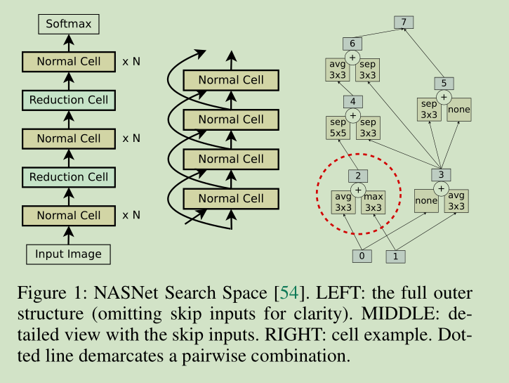

# evoNAS
Repo for 3rd year research project: Evolutionary Neural Architecture Search

以下**LEFT、MIDDLE、RIGHT**表示上图对应的左中右三图

用NASNet的结构(上图)来做，LEFT和MIDDLE是选定的外部结构，我们要做的是选定Cell的结构(RIGHT)，由于规定所有Cell的结构都是统一的，所以只对一个做演化就可以了

具体要做的就是对于RIGHT图中2-6这5个hidden layer，给他们选定他们的输入和对应的卷积核(各用两个参数表示).

“5个”hidden layer，这个个数是个超参

0，1是上层和隔层获得的输入(见MIDDLE)，对于第一层就直接把原始数据复制两份分别输入

隐层7的输入来自与2-6中所有没有被用到的隐层

##### Representation

用一个list嵌套来表示Cell的结构：
$$
[[a_2,b_2,e_2,f_2],...,...,...,[a_6,b_6,e_6,f_6]]
$$
每一个子list代表一个hidden layer的参数，这五个分别是2-6号hidden layer的参数

a,b代表输入的隐层，对于 $k$ 号隐层 ，他的输入隐层取自 0~$k-1$

e,f是其使用的卷积核, 用1~13的编号表示：

1. identity
2. 1x7 then 7x1 convolution
3. 3x3 average pooling
4. 5x5 max pooling
5. 1x1 convolution
6. 3x3 depthwise-separable conv
7. 7x7 depthwise-separable conv
8. 1x3 then 3x1 convolution
9. 3x3 dilated convolution
10. 3x3 max pooling
11. 7x7 max pooling
12. 3x3 convolution
13. 5x5 depthwise-seperable conv

